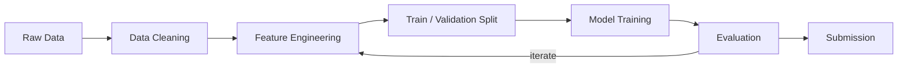

# Kaggle Project: House Prices

> **Competition:** [House Prices — Advanced Regression Techniques](https://www.kaggle.com/competitions/house-prices-advanced-regression-techniques)
> **Goal:** Predict the sales price for each house based on 79 explanatory variables.
> **Metric:** RMSE (Root Mean Squared Error on log-transformed prices).

## Pipeline



## Quick Start

```bash
# 1. Clone this repo
gh repo clone benoit-bremaud/kaggle-house-prices

# 2. Setup environment
make setup

# 3. Download competition data
make data COMPETITION=house-prices-advanced-regression-techniques

# 4. Start working
make notebook
```

## Project Structure

```
.
├── data/
│   ├── raw/              # Original competition data (gitignored)
│   └── processed/        # Cleaned/transformed data (gitignored)
├── notebooks/
│   └── notebook.ipynb    # Main analysis notebook
├── src/
│   ├── __init__.py
│   └── utils.py          # Reusable helper functions
├── outputs/
│   ├── models/           # Saved models (gitignored)
│   └── submissions/      # Submission CSVs + log
├── .pre-commit-config.yaml
├── Makefile              # Automation commands
├── setup.sh              # Environment setup script
├── requirements.txt      # Python dependencies
└── pyproject.toml        # Project config + ruff settings
```

## Available Commands

| Command | Description |
|---|---|
| `make setup` | Install dependencies, configure hooks |
| `make notebook` | Launch Jupyter Lab |
| `make lint` | Check code quality with ruff |
| `make format` | Auto-format code with ruff |
| `make clean` | Remove temporary files |
| `make data COMPETITION=house-prices-advanced-regression-techniques` | Download competition data via Kaggle API |
| `make submit COMPETITION=house-prices-advanced-regression-techniques FILE=outputs/submissions/submission.csv` | Submit predictions via Kaggle API |

## Decisions

See [DECISIONS.md](DECISIONS.md) for project-specific architectural decisions.
See the [global DECISIONS.md](../DECISIONS.md) for decisions that apply to all Kaggle projects.

## Evolution Roadmap

| Phase | Addition | Trigger |
|---|---|---|
| Phase 1 (current) | Makefile + nbstripout + pre-commit + ruff | Initial setup |
| Phase 2 | Kaggle API Makefile targets | After first manual submission |
| Phase 3 | GitHub Actions CI | After 2-3 competitions |
| Phase 4 | DVC for data versioning | Datasets > 500MB |
| Phase 5 | Docker devcontainer | Collaboration or GPU needs |

## License

[MIT](LICENSE)
